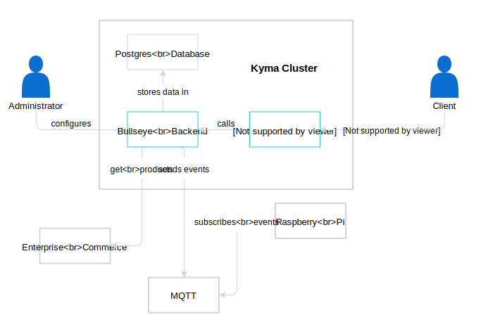

# Bullseye Showcase

## Overview
   Bullseye is a smart shelf system that suggests products depending on preferences.
   Customer fills in a questionnaire consisting of single choice questions and
   submits their choices. Then application lights up shelf with the best matching
   product based on given answers to visually indicate which products to pick up
   and presents overall result on the screen.

   Bullseye consists of two parts:
   - backend (server)
   - frontend (client)
   - Raspberry PI client (for controlling shelves)
   - hardware (used on each shelf individually)
   - set of shelves with lights connected to Raspberry Pi
     
   Bullseye communicates with RPI using MQTT protocol which is not included in this project.

## Prerequisites
   - Kyma cluster for deployment
   - MQTT server for communication with hardware
   - Raspberry PI with *raspberry* client deployed
   - Shelves with *hardware* code installed and physically connected to RPI
   - SAP Commerce Cloud instance with Omni Commerce Connect extension

## Installation
   Refer to [installation](./backend/docs/installation.org) document.
   
## Configuration
   Refer to [configuration](./backend/docs/configuration.org) document.

## Usage
   

   [frontend](./frontend) part of application presents questionnaire which consists of single choice questions.
   After submitting answers a list of available products, sorted descending by matching score
   is being presented to a user. The best matching product is exposed on a top of a site.
   A shelf with the chosen product is being light up to indicate what should be picked by the user.
   For more details refer to [frontend docs](./frontend/README.md).

   [backend](./backend) part is for an administrator to adjust questions, answers, products and
   mappings between them. For more details refer to [backend docs](./backend/README.md).

   [raspberry](./raspberry) part introduces client for Raspberry PI which enables communication through MQTT broker.
   It controls shelves connected to RPI using [hardware](./hardware) part. For more details refer to
   [raspberry docs](./raspberry/README.md) and [hardware docs](./hardware/README.md).

## Development
1. Fork the repository in Github.
2. Clone the fork to your `$GOPATH` workspace. Use this command to create the folder structure and clone the repository under the correct location:

    ```
    git clone git@github.com:{GitHubUsername}/bullseye-showcase.git $GOPATH/src/github.com/kyma-incubator/bullseye-showcase
    ```

    Follow the steps described in the [`git-workflow.md`](https://github.com/kyma-project/community/blob/master/contributing/03-git-workflow.md) document to configure your fork.
